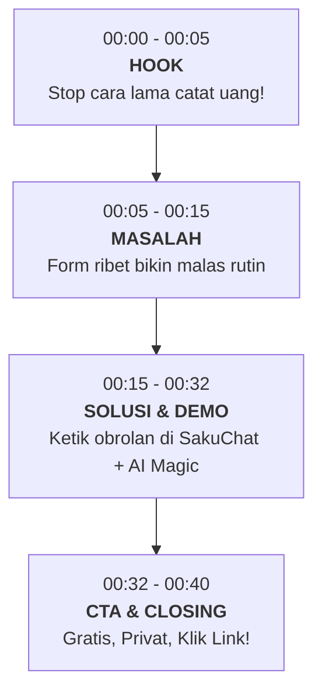

# 🚀 Marketing & Promotion Brief: SakuChat
**Asisten Keuangan Pribadi Berbasis Chat dengan AI Privat & Offline-First**

---

> [!IMPORTANT]
> **Unique Selling Proposition (USP) / Nilai Jual Utama SakuChat**
> Sebelum membagikan pesan promosi, ketahui 5 alasan utama mengapa orang **pasti tertarik** menggunakan SakuChat dibanding aplikasi keuangan lain:
> 1. **Semudah Chatting di WhatsApp:** Tidak perlu mengisi form rumit atau drop-down berlevel. Cukup ketik alami: *"Makan siang padang 35rb sama es jeruk 10rb"*.
> 2. **AI Lokal 100% Privat (On-Device WebAI):** Pemrosesan bahasa dan kategorisasi dilakukan langsung di dalam chip/memori HP pengguna. **Data keuangan tidak pernah dikirim ke server AI luar**.
> 3. **100% Gratis Tanpa Iklan (No Ads):** Tidak ada paywall pengganggu, tidak ada pop-up iklan judi/pinjol.
> 4. **Berfungsi Tanpa Internet (Offline-First):** Bisa mencatat pengeluaran di mana saja, bahkan di area tanpa sinyal atau di pesawat.
> 5. **Aplikasi Ringan (PWA 1-Klik Pasang):** Tidak perlu download beratus-ratus Megabyte dari App Store/Play Store, cukup klik "Add to Home Screen".

---

## 💬 1. Copywriting untuk Grup Chat (WhatsApp / Telegram / Discord)

### A. Tipe Santai & Relatable (Grup Teman Nongkrong / Alumni / Kantor)
```text
Guys, mau nanya dong.. Ada nggak yang tiap akhir bulan suka bingung uang gaji/bulanan habis ke mana aja? 😭

Sama banget, dulu w juga males catat pengeluaran gara-gara aplikasi keuangan tuh ribet banget, harus pilih kategori, sub-kategori, isi tanggal satu-satu.

Akhirnya w nemu (dan pake) aplikasi baru namanya **SakuChat**!
Pencatatannya tuh beneran SEMUDAH CHATTING! 📱✨

Cuma tinggal ketik/chat:
💬 "Beli bensin pertalite 35rb"
💬 "Grab ke stasiun 24000"
💬 "Nongkrong kopi susu sama budi 45rb"

Langsung otomatis dikelompokkan kategorinya & dibikin grafik analisisnya sama AI! 🤖📊

Yang paling gokil:
✅ 100% GRATIS & TANPA Iklan mengganggu
✅ Privat! AI-nya jalan langsung di HP kita (Offline-first)
✅ Bisa langsung dipasang jadi aplikasi di layar utama HP

Cobain deh langsung di browser HP kalian (gak perlu install berat-berat):
👉 https://sakuchat.smartpixel.id

Yuk biar keuangan kita makin sehat! 💸🙏
```

### B. Tipe Informatif & Professional (Grup Komunitas Teknologi / Finansial / Pekerja)
```text
Halo rekan-rekan semua, izin berbagi rekomendasi tools keuangan pribadi gratis yang sangat menarik: **SakuChat** 🚀

Berbeda dengan aplikasi pencatat kas tradisional yang memerlukan banyak klik, SakuChat mengusung konsep *Conversational Expense Tracking*. Kita cukup mengetikkan kalimat natural, dan sistem akan mencatat serta mengelompokkan pengeluaran secara akurat.

Keunggulan dari segi Teknologi & Keamanan:
🔒 **On-Device WebAI:** Menggunakan model kecerdasan buatan mini yang berjalan 100% di dalam peramban (*client-side*). Data finansial Anda tetap privat di perangkat.
📶 **Offline-First Architecture:** Berfungsi penuh tanpa koneksi internet dengan penyimpanan lokal berkecepatan tinggi.
☁️ **1-Click Google Cloud Sync:** Mendukung pencadangan aman antar perangkat tanpa duplikasi data.
📲 **Zero-Install PWA:** Aplikasi berkinerja tinggi layaknya native app cukup dengan "Add to Home Screen".

Sepenuhnya gratis dan bebas iklan. Silakan dicoba dan dirasakan kemudahannya:
🔗 https://sakuchat.smartpixel.id
```

---

## 📱 2. Konsep Konten Story (WhatsApp Story / Instagram Story / Twitter / Threads)

Gunakan format **4 Slide Bertutur (Storytelling Sequence)** untuk interaksi maksimal:

| Slide | Tipe Konten | Teks / Copywriting di Layar | Visual / Gambar Pendukung |
| :--- | :--- | :--- | :--- |
| **Slide 1** | **Hook (Relatable Pain Point)** | *"Tanggal muda berasa sultan... Tanggal 20 ke atas cuma bisa bengong liat saldo ATM tinggal digit receh 😭 Siapa yang relate?"* | Background warna gelap/stiker meme menangis atau screenshot dompet kosong dengan jajak pendapat (Poll): *"Relate banget / Enggak w rajin"*. |
| **Slide 2** | **Agitation (Alasan Gagal)** | *"Jujur, mau rutin catat pengeluaran tuh MALES BANGET kalau aplikasinya ribet. Harus klik sana-sini, pilih kategori, banyak iklan pop-up lagi! 😡"* | Screenshot aplikasi kas konvensional yang rumit atau stiker bingung. |
| **Slide 3** | **Solution (Magic Moment)** | *"Sampe akhirnya nemu **SakuChat**! Catat pengeluaran tinggal ketik kayak chat WA biasa! AI-nya otomatis langsung bikinin grafik & deteksi boros! 🪄🤖"* | **[PENTING] Rekam layar (Screen Recording) 5 detik** saat mengetik kalimat di SakuChat dan muncul respons AI instan. |
| **Slide 4** | **Call to Action (CTA)** | *"Yang mau keuangannya makin rapi: <br>✨ 100% GRATIS SELAMANYA <br>✨ Tanpa Iklan <br>✨ Data 100% Privat & Offline <br><br>👉 Klik link di bio / tautan di bawah ini ya!"* | Link sticker menuju `https://sakuchat.smartpixel.id` dengan panah menunjuk ke link. |

---

## 🎬 3. Brief Skrip Video Promosi Pendek (Reels / TikTok / YouTube Shorts)
**Durasi:** 35 – 45 Detik  
**Konsep Visual:** *Dynamic Screen Recording + Voiceover Santai (atau Teks Cepat dengan Musik Viral)*



### Breakdown Skrip Adegan per Adegan:

#### 🟢 Adegan 1: Hook (00:00 - 00:05)
* **Visual:** Seseorang memegang kepala pusing melihat struk belanjaan yang menumpuk, lalu transisi cepat mencoret form aplikasi keuangan yang rumit.
* **Teks di Layar:** *"Masih catat pengeluaran pakai cara ribet ini?!"*
* **Voiceover (VO):** *"Jujur deh, alasan utama kamu gagal catat pengeluaran tuh pasti gara-gara aplikasinya ribet kan?"*

#### 🟡 Adegan 2: Masalah (00:05 - 00:15)
* **Visual:** Cuplikan layar aplikasi konvensional di mana user harus klik drop-down kategori, pilih sub-kategori, ketik nominal terpisah.
* **Teks di Layar:** *"Banyak form = Keburu males!"*
* **Voiceover (VO):** *"Harus pilih tanggal, klik drop-down kategori, belum lagi kalau muncul iklan pop-up pas lagi buru-buru!"*

#### 🟣 Adegan 3: Solusi & Demo Fitur (00:15 - 00:32)
* **Visual:** Rekaman layar HP membuka **SakuChat**. Mengetik di kolom obrolan: *"Beli es kopi kenangan 25rb sama parkir 3rb"*. Klik kirim, instan muncul gelembung sukses dan saldo berkurang. Geser ke tab Laporan melihat persentase kategori dan peringatan "Zona Bahaya / Lonjakan".
* **Teks di Layar:** *"Kenalin: SakuChat! Semudah nge-chat WA!"*
* **Voiceover (VO):** *"Mending cobain SakuChat! Kamu cuma tinggal ketik pengeluaranmu kayak lagi chattingan sama temen. Ketik 'Kopi 25 ribu sama parkir 3 ribu', dan BUM! AI-nya langsung hitung otomatis dan rapihin kategorinya! Nggak ada iklan, bisa dipakai offline, dan datamu 100% privat aman di HP kamu."*

#### 🔵 Adegan 4: Call to Action (00:32 - 00:40)
* **Visual:** Menampilkan beranda SakuChat dengan teks domain jelas, lalu mendemonstrasikan tombol instal "Pasang Sekarang" di layar.
* **Teks di Layar:** *"Gratis Selamanya! Coba sekarang di SakuChat"*
* **Voiceover (VO):** *"Mumpung 100% gratis selamanya, langsung cobain sekarang juga. Klik tautan di bio atau kunjungi sakuchat.smartpixel.id!"*

---

## 💡 Tips Ekstra agar Promosi Sukses Besar (Viral Hack)
1. **Highlight Kata "GRATIS & TANPA IKLAN":** Saat ini masyarakat sangat lelah dengan aplikasi finansial berkedok gratis yang ternyata mengharuskan langganan (*subscription*) atau penuh iklan pop-up. Kata kunci ini adalah magnet terkuat Anda.
2. **Tekankan Keunggulan "Gak Perlu Install Menuhi Memori":** Karena SakuChat berbasis Web/PWA, orang bisa langsung mencoba dalam 2 detik tanpa perlu menunggu proses download di Play Store/App Store.
3. **Minta Testimoni Jujur:** Setelah membagikan ke grup terdekat, tanyakan: *"Coba tes ketik kalimat pengeluaran kalian yang paling unik, AI-nya berhasil nebak kategorinya gak?"* Ini akan memicu rasa penasaran anggota grup lain untuk ikut mencoba!
